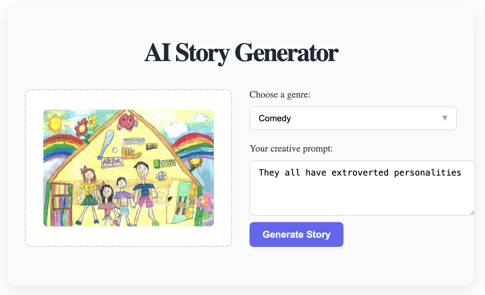

# AI Image Storyteller
AI image analysis and story creation web application based on React + FastAPI + LangChain.

It analyzes the uploaded images and automatically creates creative stories based on them.



## Feautures
- Uploading and Analyzing Images (LangChain + OpenAI API)
- Create a story based on analysis results
- Reflexion Agent techniques to improve 2 iterations
- Front end: React + Typescript
- Backend: FastAPI + LangChain

## Skill Stacks
**Frontend**
- React
- Vite

**Backend**
- FastAPI
- LangChain
- OpenAI GPT-4 / GPT-5 API

**Others**
- Python 3.11+
- Node.js 18+

## Architecture

The agent uses a graph-based architecture with the following components:

Entry Point: caption node for initial image caption response generation
Maximum Iterations: 2 (configurable)
Chain Components: First responder for creating story based on image captionand and revisor using GPT-4 / GPT-5

## Environment Variables

To run this project, you will need to add the following environment variables to your .env file:

```
OPENAI_API_KEY=your_openai_api_key_here
LANGCHAIN_API_KEY=your_langchain_api_key_here  # Optional, for tracing
LANGCHAIN_TRACING_V2=true                      # Optional
LANGCHAIN_PROJECT=reflexion agent               # Optional
```

## Run Locally

Clone the project:
```
git clone <repository-url>
cd story-generator
```

Install dependencies:
```
poetry install
```

Start the backend:
```
cd backend
uvicorn main:app --host 0.0.0.0 --port 8000
```

Start the frontend
```
cd frontend
npm install
npm run dev
```

